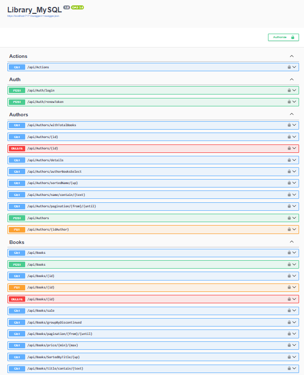

## Library_MySQL

**Library_MySQL** is an ASP.NET Core 8.0 Web API that manages library-related information, including authors, books, and publishing houses, as well as handling user authentication and logging actions performed on the system. It uses MySQL, Entity Framework Core and JWT for authentication. 


Library_MySQL/  
│  
├── AutoMappers/  
│   └── MappingProfile.cs  
│  
├── Classes/  
│   └── HashResult.cs  
│  
├── Controllers/  
│   ├── ActionsController.cs  
│   ├── AuthController.cs  
│   ├── AuthorsController.cs  
│   ├── BooksController.cs  
│   ├── PublishingHousesController.cs  
│   └── UsersController.cs  
│  
├── DTOs/  
│   ├── AuthorBookDTO.cs  
│   ├── AuthorDTO.cs  
│   ├── AuthorInsertDTO.cs  
│   ├── AuthorUpdateDTO.cs  
│   ├── BookDTO.cs  
│   ├── BookGroupDTO.cs  
│   ├── BookInsertDTO.cs  
│   ├── BookItemDTO.cs  
│   ├── BookSaleDTO.cs  
│   ├── BookUpdateDTO.cs  
│   ├── LoginResponseDTO.cs  
│   ├── PublishingHouseBookAuthorDTO.cs  
│   ├── PublishingHouseBookDTO.cs  
│   ├── PublishingHouseDTO.cs  
│   ├── PublishingHouseInsertDTO.cs  
│   ├── PublishingHouseUpdateDTO.cs  
│   ├── UserChangePasswordDTO.cs  
│   └── UserDTO.cs  
│  
├── Models/  
│   ├── Action.cs  
│   ├── Author.cs  
│   ├── Book.cs  
│   ├── LibraryContext.cs  
│   ├── PublishingHouse.cs  
│   └── User.cs  
│  
├── Repository/  
│   ├── AuthorRepository.cs  
│   ├── BookRepository.cs  
│   ├── IAuthorRepository.cs  
│   ├── IBaseRepository.cs  
│   ├── IBookRepository.cs  
│   ├── IPublishingHouseRepository.cs  
│   └── PublishingHouseRepository.cs  
│  
├── Services/  
│   ├── ActionsService.cs  
│   ├── AuthorService.cs  
│   ├── BookService.cs  
│   ├── HashService.cs  
│   ├── IAuthorService.cs  
│   ├── IBookService.cs  
│   ├── ICommonServiceBase.cs  
│   ├── IManagerFiles.cs  
│   ├── IPublishingHouseService.cs  
│   ├── ITokenService.cs  
│   ├── ManagerFiles.cs  
│   ├── PublishingHouseService.cs  
│   └── TokenService.cs  
│  
├── Validators/  
│   ├── AuthorInsertValidator.cs  
│   ├── AuthorUpdateValidator.cs  
│   ├── BookInsertValidator.cs  
│   ├── BookUpdateValidator.cs  
│   ├── GroupFileType.cs  
│   ├── NonNegativePagesValidation.cs  
│   ├── PublishingHouseInsertValidator.cs  
│   ├── PublishingHouseUpdateValidator.cs  
│   ├── ValidationFileType.cs  
│   └── WeightFileValidation.cs  
│  
├── appsettings.json  
└── Program.cs  





## Program
```cs 
var connectionString = builder.Configuration.GetConnectionString("Connection");
builder.Services.AddDbContext<LibraryContext>(options =>
{
    options.UseMySql(connectionString, new MySqlServerVersion(new Version(8, 0, 31)));
});
``` 

## appsetting.Development.json
```cs 
{
  "ConnectionStrings": {
        "Connection": "Server=localhost;Port=3306;Database=library;User=root;Password=root"
}
``` 


[DeepWiki moraisLuismNet/Library_MySQL](https://deepwiki.com/moraisLuismNet/Library_MySQL)